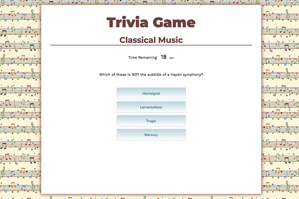

# Trivia Game

### Overview
Trivia game using JavaScript for the logic and jQuery to manipulate HTML

### Links
- [Link to the page](https://yuda0110.github.io/TriviaGame/)
- [Link to the code](https://github.com/yuda0110/TriviaGame)

### Tech/framework used

- HTML
- CSS
- JavaScript
- jQuery

### How to use?
Click on the "Start" button to start playing.

Select an answer before the time runs out.

On the final screen, you will see the number of correct answers, incorrect answers, and an option to restart the game.

